МИНИСТЕРСТВО НАУКИ  И ВЫСШЕГО ОБРАЗОВАНИЯ РОССИЙСКОЙ ФЕДЕРАЦИИ  
Федеральное государственное автономное образовательное учреждение высшего образования  
"КРЫМСКИЙ ФЕДЕРАЛЬНЫЙ УНИВЕРСИТЕТ им. В. И. ВЕРНАДСКОГО"  
ФИЗИКО-ТЕХНИЧЕСКИЙ ИНСТИТУТ  
Кафедра компьютерной инженерии и моделирования
  
​
### Отчёт по лабораторной работе № 01   по дисциплине "Программирование"
 
​
студента 1 курса группы ПИ-б-о-192(2)
Лунгула Кирилла Александровича  
направления подготовки 09.03.04 "ПРОГРАММНАЯ ИНЖЕНЕРИЯ"  
 
​
<table>
<tr><td>Научный руководитель  старший преподаватель кафедры  компьютерной инженерии и моделирования</td>
<td>(оценка)</td>
<td>Чабанов В.В.</td>
</tr>
</table>
  
​
Симферополь, 2019  

#### Цель:изучить основные возможности создания и отладки программ в IDE MS Visual Studio  
#### Ход работы  

**1.Как создать консольное приложение С++**  
Для начала следует установить и открыть *MS Visual Studio*    (рис. 1).  
Далее в верхнем левом углу нажать на: *Файл-> Создать-> Проект*  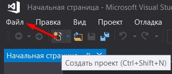 (*Рис.2*).  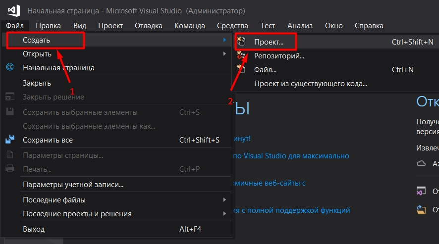 (*Рис.3*).  
После этого на экране появиться окно с выбором проекта. Мы вибираем *"Консольное приложение Windows  Visual C++"* и нажимаем *"Ок"*  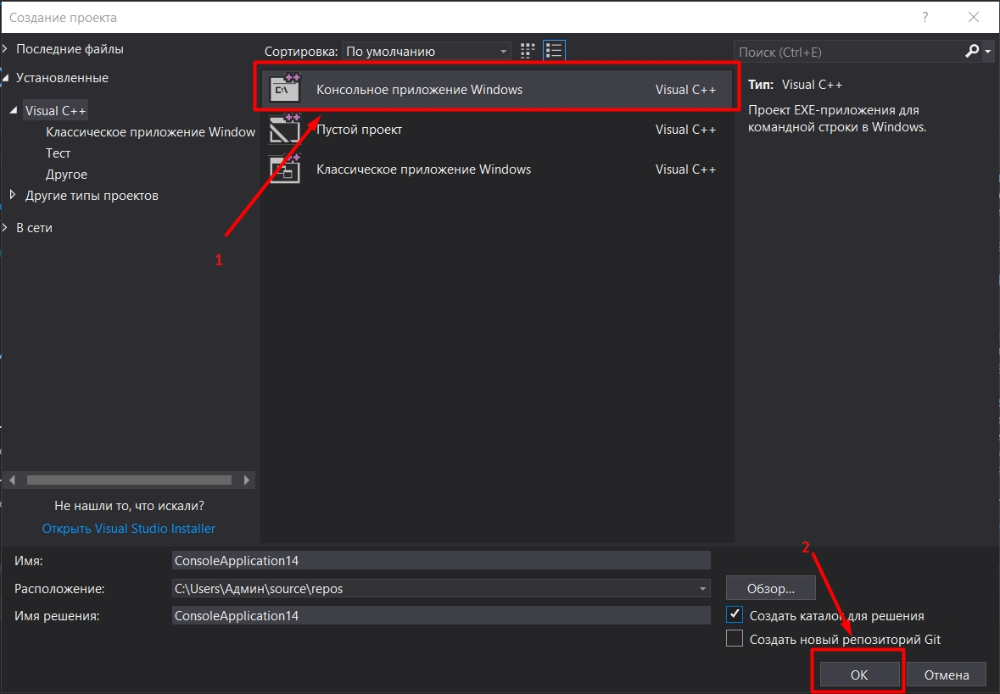 (*Рис.4*). 
После нажатия на кнопку у нас начинается создание проекта и повляеться окно,где мы можем писать код  

**2.Как изменить цветовую схему (оформление) среды** 
Для изменения цветовой схемы требуется нажать на: *Средства-> Параметры* 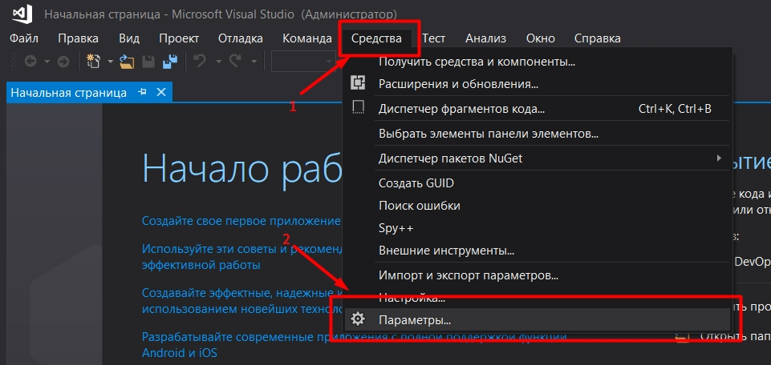 (*Рис.5*) .
В появившемся окне справа найти *"Общие"*, найти *"Цветовая схема"* и нажать на список справа от нее. 
В списке выбрать интересующую вас тему и нажать *"ОК"*    (*Рис.6*). 
После нажатия на кнопку среда поменяет тему на ту,которую вы выбрали  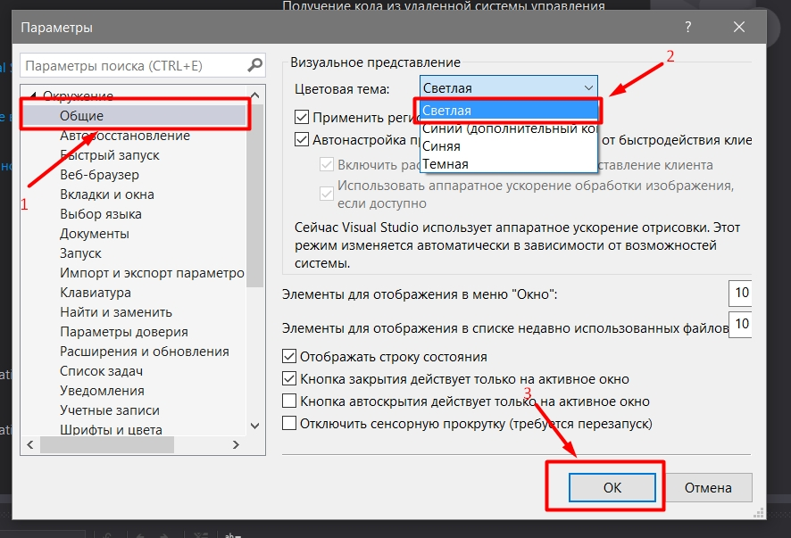 (*Рис.7*).  

**3.Как закомментировать/раскомментировать блок кода средствами VS** 
1. Для того,чтобы закоментировать код,нужно: Выделить часть кода,которую вы хотите закоментировать  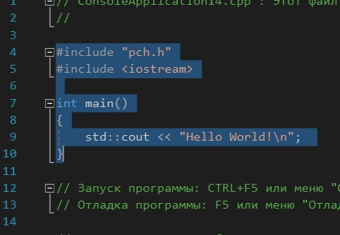 (*Рис.8*)  и нажать комбинацию *Ctrl+K,Ctrl+C*  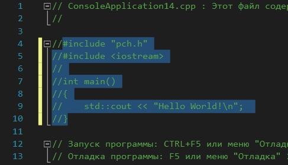 (*Рис.9*). 
2. Для того,чтобы раскоментировать код,нужно: Выделить часть кода,которую вы хотите раскоментировать  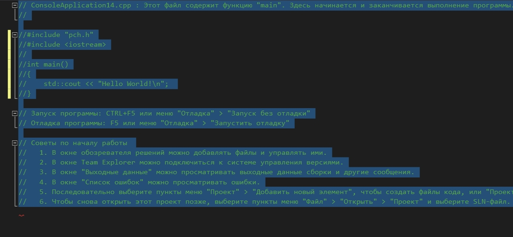 (*Рис.10*)  и нажать комбинацию *Ctrl+K,Ctrl+U*  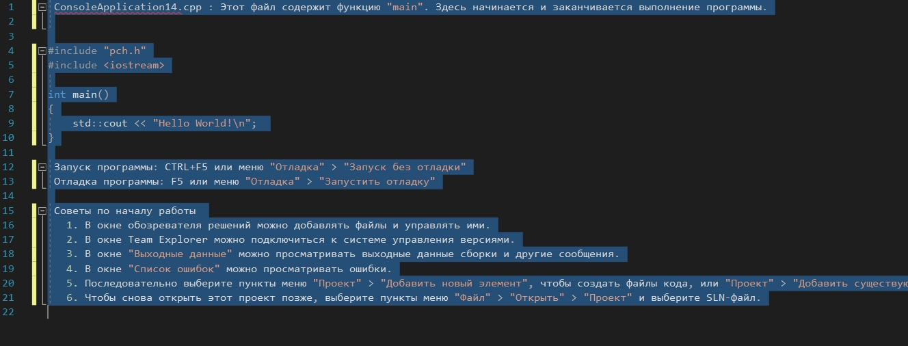 (*Рис.11*). 

**4.Как открыть в проводнике Windows папку с проектом средствами VS** 
Чтобы открыть проект,нужно нажать на:*Файл-> Открыть-> Решение или проект* 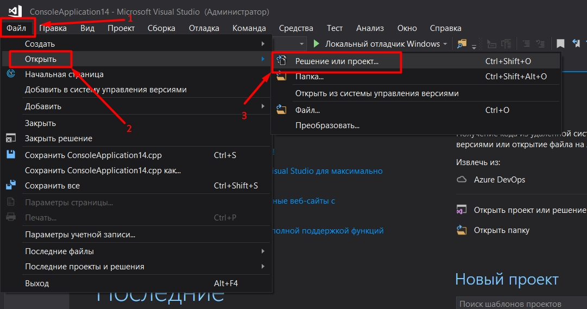 (*Рис.12*). 
Далее вы попадёте в проводник со всеми соханенными проектами в папке repos 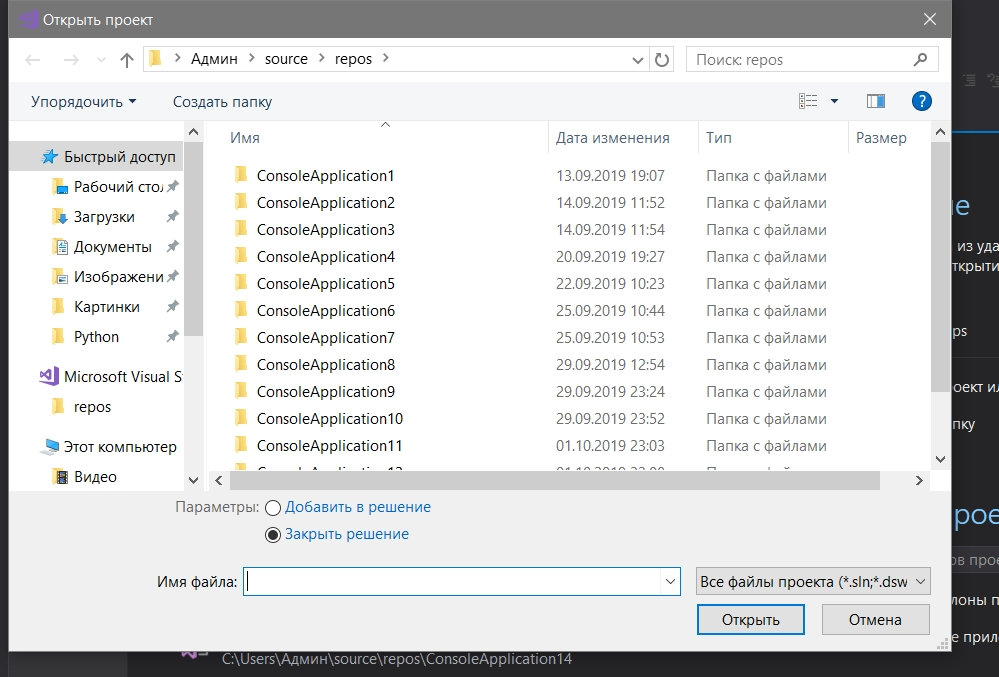 (Рис.13). 
Выбираем папку с проектом и переходим в такую же папку  (*Рис.14*). 
В ней ищем файл с расширением *".vcxpoj"*,нажимаем на него после чего нажимаем *"ОК"* 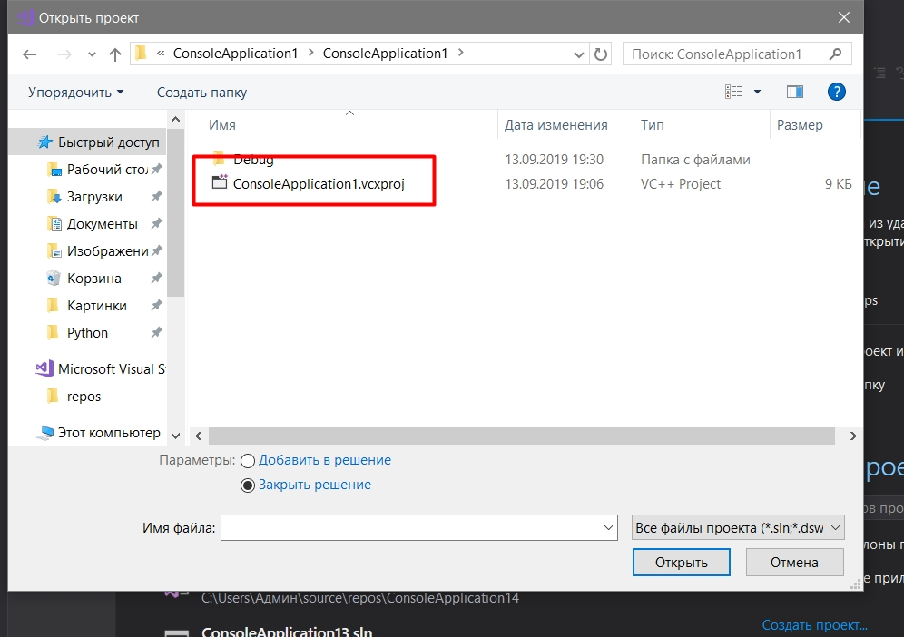 (*Рис.15*). 

**5.Какое расширение файла-проекта используется в VS** 
Файл-проекта использует *".vcxpoj"* 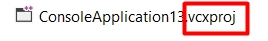 (*Рис.16*). 

**6.Как запустить код без отладки (не менее 2 способов)** 
Для того,чтобы запустить код без отладки нужно нажать на: Отладка-> Запуск без отладки; или просто нажать *Ctrl+F5*; 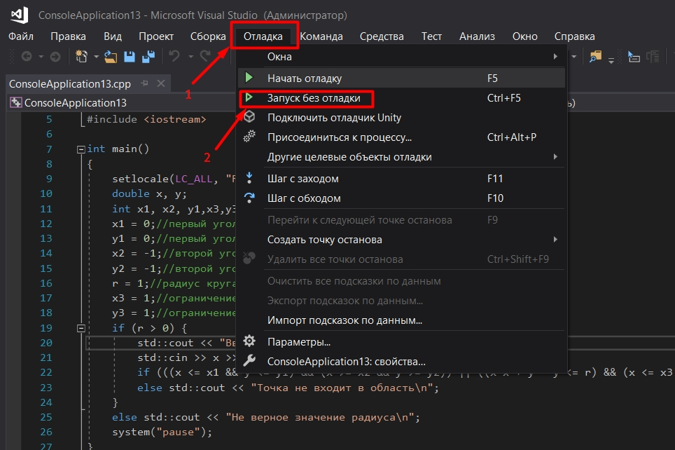 (*Рис.17*). 
После чего запустится консоль 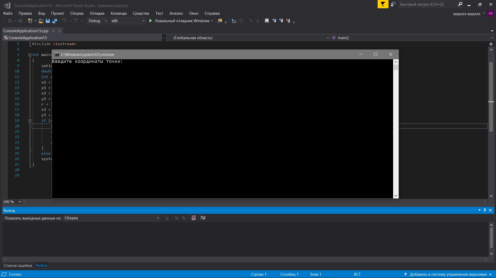 (*Рис.18*) 

**7.Как запустить код в режиме отладки (не менее 2 способов)** 
Для того,чтобы запустить код в режиме отладки нужно нажать на: Отладка-> Начать отладку; или просто нажать F5 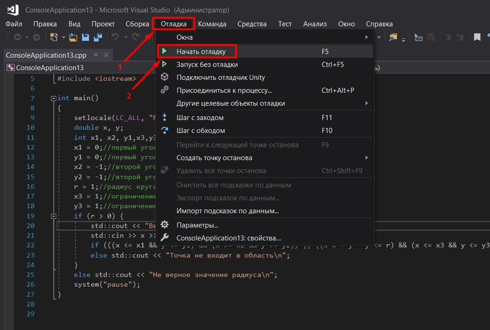 (*Рис.19*). 
После чего запустится консоль 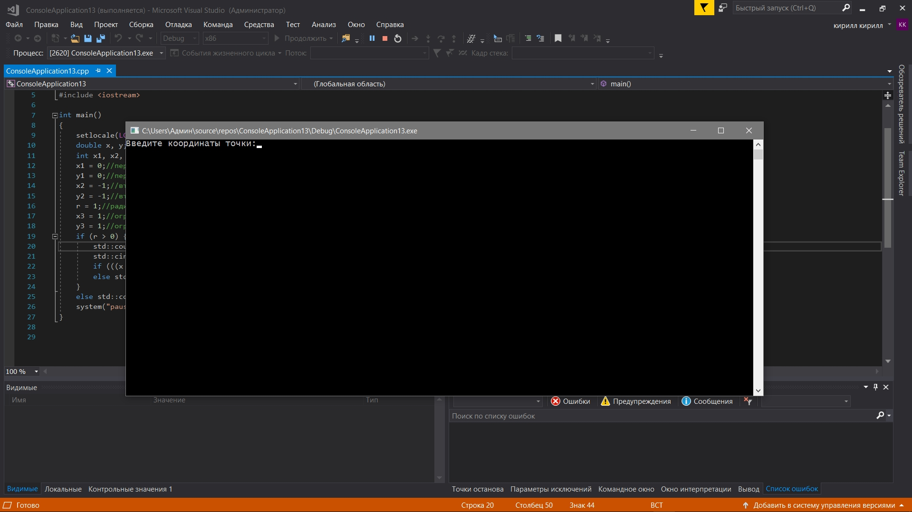 (*Рис.20*). 

**8.Как установить/убрать точку останова (breakpoint)** 
Для того,чтобы установить breakpoint,нужно нажать на полосу справа от кода 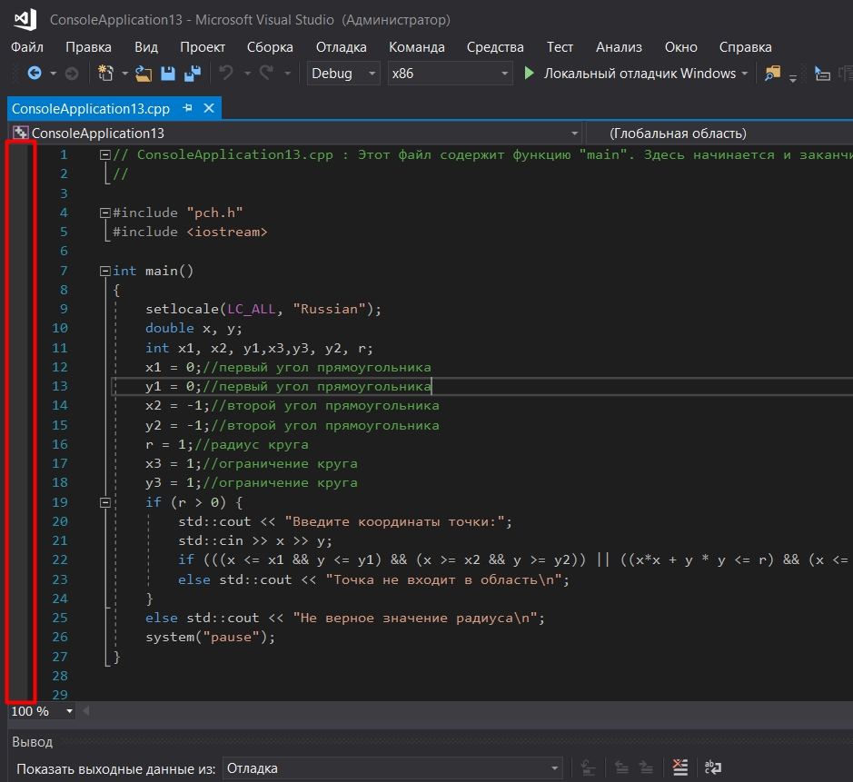 (*Рис.21*) в месте,где вы хотите поставить точку 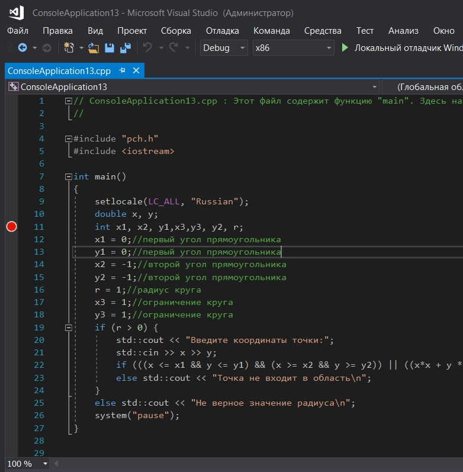(*Рис.22*). 
Для того,чтобы убрать breakpoint,нужно нажать пкм по точке,после чего нажать на "Удалить точку останова". 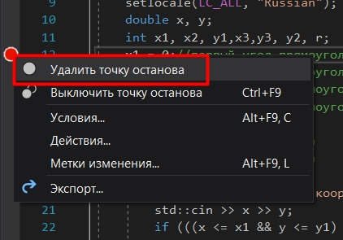 (*Рис.23*). 

**9.Создайте программу со следующим кодом:** 
~~~c++
#include <iostream>

int main() {
		int i;
		i = 5;
		std::cout << i;
		return 0;
}
~~~

Для начала, я создал консольное приложение и скопировал код в него 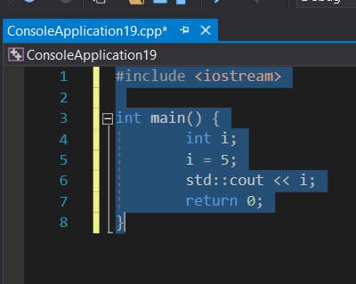 (*Рис.24*) (программа попросила библиотеку "pch.h", так что я добавил и ее.). 
Далее я поставил точки остановки там, где это требовалось в задании  (*Рис.25*). 
После этого я нажал F5 и начал отладку. 
Программа преобразовала вид 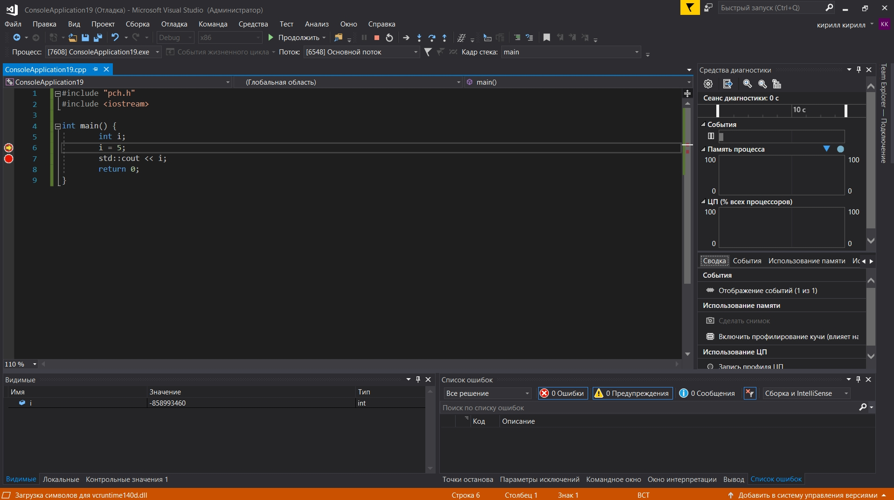 (*Рис.26*). 
Значение i в первом breakpoint 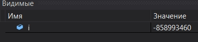 (*Рис.27*). 
Значение i во втором breakpoint 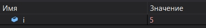 (*Рис.28*). 

**10.Выполните задание 9 изменив программу на следующую:** 
~~~C++
#include <iostream>

int main() {
		double i;
		i = 5;
		std::cout << i;
		return 0;
}
~~~
Заменив *int* на *double* я запустил программу. 
Значение i в первом breakpoint 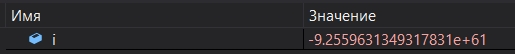 (*Рис.29*). 
Значение i во втором breakpoint 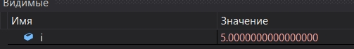 (*Рис.30*).  
**Вывод:**Я изучил основные возможности создания и отладки программ в IDE MS Visual Studio.

